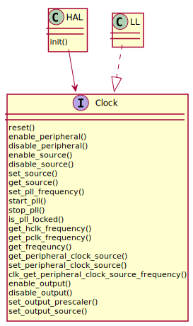

Clock
=====

Examples
--------
.. literalinclude:: ../../../examples/peripheral/clk.c
   :language: C

Interface
---------
.. doxygenfile:: halmcu/periph/clk.h
   :project: halmcu

HAL
^^^
.. doxygenfile:: halmcu/hal/clk.h
   :project: halmcu

LL
^^
.. doxygenfile:: halmcu/ll/clk.h
   :project: halmcu
