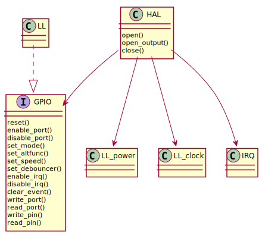

GPIO
====

Examples
--------
.. literalinclude:: ../../../examples/blinky/src/main.c
   :language: C

HAL
---
.. c:autodoc:: ../../include/abov/hal/gpio.h

LL
--
.. c:autodoc:: ../../include/abov/periph/gpio.h

Extra
-----
.. c:autodoc:: ../../include/abov/ll/gpio.h
