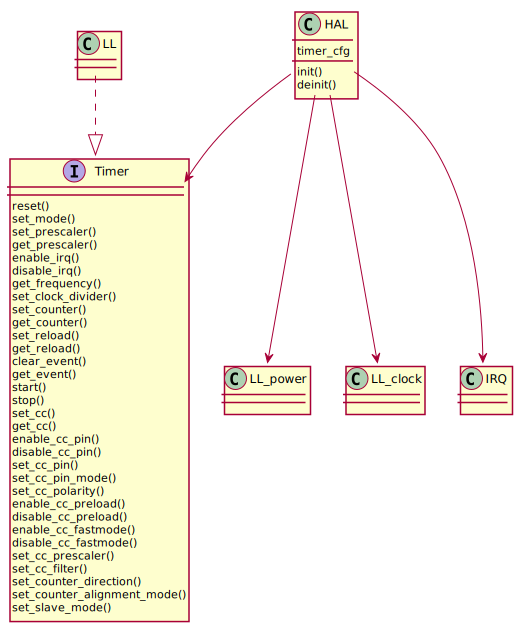

Timer
=====

Examples
--------
.. literalinclude:: ../../../examples/peripheral/timer_capture.c
   :language: C

Interface
---------
.. doxygenfile:: halmcu/periph/timer.h
   :project: halmcu

HAL
^^^
.. doxygenfile:: halmcu/hal/timer.h
   :project: halmcu

LL
^^
.. doxygenfile:: halmcu/ll/timer.h
   :project: halmcu
