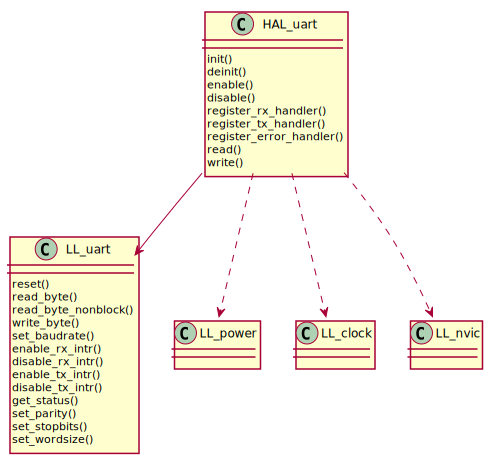

UART
====

Examples
--------
.. literalinclude:: ../../../examples/hello-world/src/main.c
   :language: C

HAL
---
.. c:autodoc:: ../../include/abov/hal/uart.h

LL
--
.. c:autodoc:: ../../include/abov/ll/uart.h
