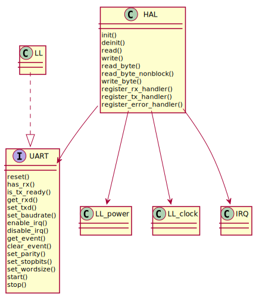

UART
====

Examples
--------
.. literalinclude:: ../../../examples/peripheral/uart.c
   :language: C

HAL
---
.. doxygenfile:: abov/hal/uart.h
   :project: libabov

LL
--
.. doxygenfile:: abov/periph/uart.h
   :project: libabov

Extra
-----
.. doxygenfile:: abov/ll/uart.h
   :project: libabov
