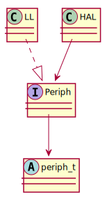

# Architecture & Design

## API


## Directory Structure

```
.
├── arch/
│   └── arm/
│       ├── cortex-m/
│       │   ├── m0plus/
│       │   ├── m3/
│       │   └── m4/
│       └── include/
│           └── CMSIS/
├── docs/
├── devices/
│   ├── common/
│   ├── abov/
│       ├── a31g/
            ...
│       └── a34m/
│   └── st/
│       └── stm32f1/
├── drivers/
├── hal/
│   ├── adc/
        ... 
│   └── uart/
├── examples/
├── include
│   └── halmcu
│       ├── asm/
│       ├── hal/
│       ├── ll/
│       └── peri/
├── projects/
│   └── devices/
└── tests/
```

| Directory | Description                                                     |
| --------- | -----------                                                     |
| arch      |                                                                 |
| docs      |                                                                 |
| devices   | low level and hardware dependent code for the specific device   |
| drivers   |                                                                 |
| hal       | hardware abstraction code. no hardware dependency               |
| examples  |                                                                 |
| include   |                                                                 |
| projects  |                                                                 |
| tests     |                                                                 |


## Build System
[Make](https://www.gnu.org/software/make/manual/make.html) build automation tool is used.

Additional tools like Kbuild or scripts are intentionally avoided not to
increase complexity.

1. You shoud specify device you want to build for, something like: `make DEVICE=a33g`
2. It will automatically include a project Makefile according to the device. e.g. `projects/devices/a33g.mk`
3. In the project Makefile, all drivers it supports are included by `devices/a33g/devices.mk`
4. Then it decides what cpu architecture is of the device
5. And build based on the architecture with its Makefile, `arch/arm/cortex-m/m3/m3.mk`

* `HALMCU_CFLAGS`
* `HALMCU_WARNING_CFLAGS`
* `CROSS_COMPILE`
* `DEVICE`
* `HSE`
* `HSI`
* `NDEBUG`

## Software Layers
### Low Level Layer
### Hardwar Abstraction Layer
### Driver Layer

## Porting
* `HALMCU_PREFIX`
